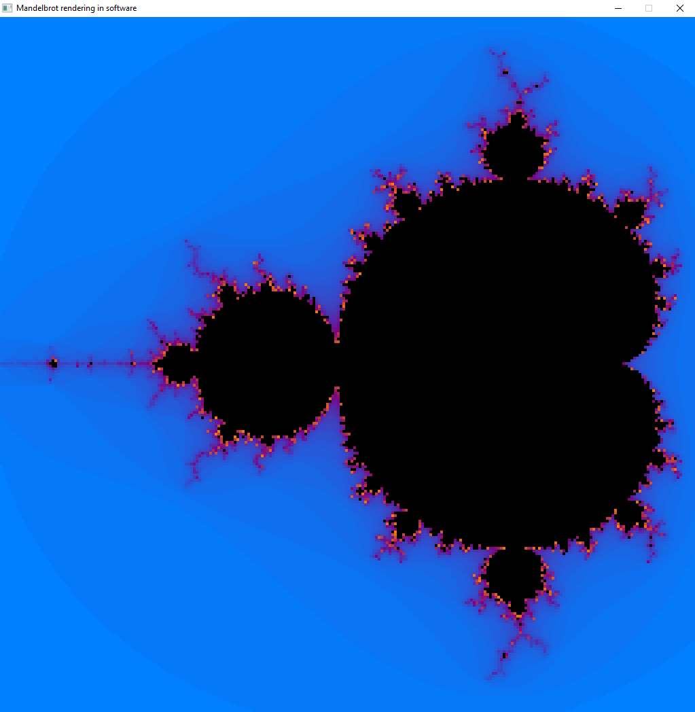

# Mandelbrot (CPU)

When I decided to try learning GPU programming, I
wanted to find something computationally intensive to render,
and - of course - went with the Mandelbrot Set.

Before implementing it as a compute shader though, I needed
a basic reference implementation just using SDL2. This would
also help illustrate the performance difference with the move
to GPU-based rendering.

## How to use it

When you run `mandelbrot.exe`, a window should open with a
(low resolution) image of the mandelbrot set displayed.
You can navigate around the set by holding left click and dragging
to pan the view around. The scrollwheel zooms in and out. If you
hold shift while scrolling, the view zooms more quickly.

Apart from that, here are the other included controls:

 - **Keypad Plus**: Increments the number of iterations performed (increases detail, but is slower)
 - **Keypad Minus**: Decrements the number of iterations
 - **F1**: Toggles whether the colour spectrum is shown at the bottom of the screen.
   this was originally for debugging, but looked nice, so I left it in.
 - **F2**: Auto Zoom-Out; When zoomed in, pressing this key starts the program automatically
   zooming out smoothly. (Holding shift during this still speeds up zooming)
 - **F3**: Switches between Mandelbrot mode and Julia mode
 - **F4**: Toggles rotating the current Julia-Set constant around (0 + 0i)
 - **F5**: Toggles a frame-time indicator display on the right side of the screen.
   This indicates how long a frame takes to render on average. If the bar reaches the
   top, this indicates it takes >= 100ms on average to render a frame.

### Mandelbrot/Julia Mode

Because the Julia Sets are so closely related to the Mandelbrot Set,
it doesn't take much to convert the Mandelbrot renderer to also do
Julia sets. This can be switched with F3. When in Julia mode, you
can hold ALT and drag the mouse around as before. You should see a red
crosshair on the screen. This indicates the position of the constant.
When you hold ALT and drag the mouse, you should see the constant point
also moving around. This way you can explore the various Julia sets.

If you want it to automatically animate through different sets, you
can press F4, which will toggle the constant point to be rotated around
(0 + 0i) smoothly.